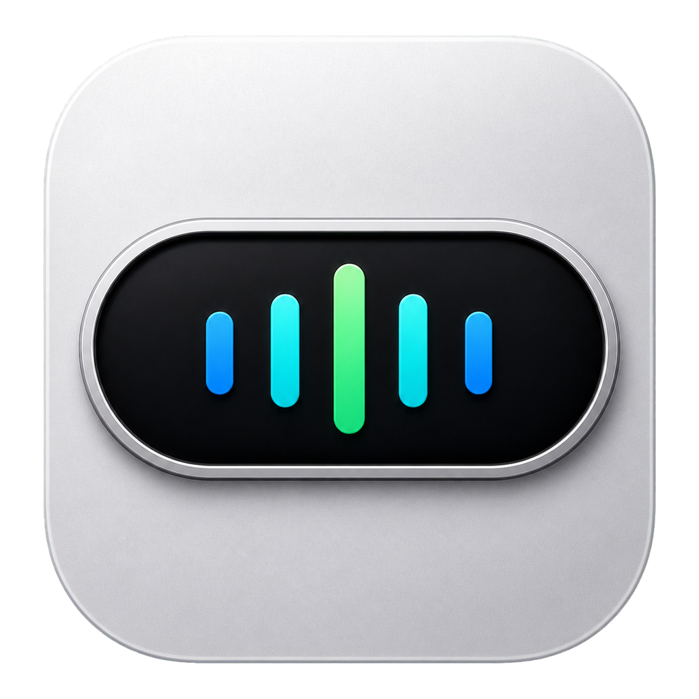

[English](README.md) | [简体中文](README-zh-Hans.md) | [繁體中文](README-zh-Hant.md) | [日本語](README-ja.md) | [한국어](README-ko.md) | **Español** | [Français](README-fr.md) | [Deutsch](README-de.md)

# AtomVoice

<p align="center"></p>

Una aplicación ligera de entrada de voz para la barra de menú de macOS. Mantén presionado **Fn** para grabar, suelta para inyectar el texto transcrito en cualquier campo de entrada activo.

  

---

### 🔒 Privacidad primero
Todo el reconocimiento de voz se ejecuta **localmente** a través del framework de reconocimiento de voz de Apple. Ningún audio se envía a ningún servidor a menos que habilites explícitamente la Optimización LLM.

### ⚡ Ligero
Paquete de aplicación de ~3 MB. CPU casi a cero en inactivo. Sin daemon en segundo plano.

---

## Características

- **Mantén Fn** para grabar, suelta para inyectar texto en cualquier campo de entrada
- **Transcripción en tiempo real** — Reconocimiento de voz de Apple, predeterminado en chino simplificado
- **Forma de onda espectral de 5 bandas FFT** — 100–6000 Hz, de baja a alta de izquierda a derecha, impulsado por Accelerate
- **Puntuación automática** — Motor de reglas local que añade marcas de fin de oración, sin conexión a internet
- **Optimización LLM** — API compatible con OpenAI que corrige términos mal reconocidos (ej: 配森→Python); 9 proveedores predefinidos + lista personalizable
- **Animación Dynamic Island** — Física de resorte real a 120 Hz con desenfoque gaussiano
- **Modo oscuro/claro** — Liquid Glass en macOS 26, desenfoque de efecto visual en sistemas anteriores
- **7 idiomas de interfaz** — English, 简体中文, 繁體中文, 日本語, 한국어, Español, Français, Deutsch
- **Compatible con IME CJK** — Cambia automáticamente a fuente de entrada ASCII antes de pegar

## Requisitos

- macOS 13 Ventura o posterior
- Permisos requeridos: **Accesibilidad**, **Micrófono**, **Reconocimiento de voz**

## Instalación

**Desde Release (recomendado)**

Descarga desde [Releases](https://github.com/BlackSquarre/AtomVoice/releases), descomprime y arrastra a Aplicaciones.

**Compilar desde el código fuente**

```bash
git clone https://github.com/BlackSquarre/AtomVoice.git
cd AtomVoice
make install
```

## ⚠️ Aviso de Gatekeeper

Firma ad-hoc (sin notarización). En la primera apertura:

1. Haz clic derecho en `AtomVoice.app` → **Abrir** → haz clic en **Abrir**
2. O ve a **Ajustes del Sistema → Privacidad y Seguridad** → **Abrir de todos modos**
3. O ejecuta: `xattr -cr /Applications/AtomVoice.app`

## Uso

| Acción | Resultado |
|--------|-----------|
| Mantener Fn | Iniciar grabación |
| Soltar Fn | Detener e inyectar texto |
| Icono de la barra de menús | Cambiar idioma / animación / configuración LLM |

## Configuración de Optimización LLM

Barra de menús → **Optimización LLM** → **Ajustes** — selecciona un proveedor predefinido o añade el tuyo, ingresa la API Key y el nombre del modelo.

Proveedores predefinidos: OpenAI / DeepSeek / Moonshot (Kimi) / Qwen / GLM / Yi / Groq / Ollama (local)

## Comandos de compilación

```bash
make build    # Compilar paquete .app
make run      # Compilar e iniciar
make install  # Instalar en /Applications
make release  # Compilar paquetes Universal + AppleSilicon + Intel
make clean    # Limpiar artefactos de compilación
```

## License

MIT
